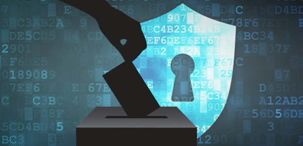

# BigData-et-Politique

## Authors 

* Wiam Adnan
* Aymane Hanine
* Anas Ouled Sbouria
* Mehdi Hamdoun
* Mohamed Ait Hajjoub
* Oussama Talliby

## Abstract

Big Data has a significant impact on politics as it can be used to identify voting patterns, target campaign messages, and analyze public opinion. However, the use of big data also raises ethical and privacy concerns such as the collection and use of personal data without consent and potential bias in the data and models. It is important for political campaigns, organizations, and individuals to understand and address these concerns to ensure responsible and effective use of big data in politics.

## Contents 
- [Chapter 1](Chapiter_1.md) Introduction
- [Chapter 2](Chapter_2.md) Les campagnes politiques
- [Chapter 3](Chapter_3.md) Modèles prédictifs et politique
- [Chapter 4](Chapter_4.md) Questions d'éthique et de confidentialité
- [Chapter 5](Chapter_5.md) Biais dans les données
- [Chapter 6](Conclusion.md) Conclusion

